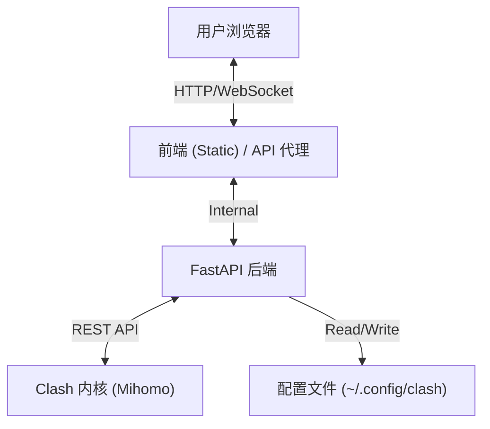

# ClashWebUI

<div align="center">


**ClashWebUI: 现代化 Clash 网页控制台**

基于 **React 18** + **FastAPI** 构建，提供与原版客户端一致的 "Premium" 级视觉体验与交互逻辑。

[特性](#-特性) • [安装](#-快速开始) • [架构](#-架构设计) • [API 文档](#-后端-api) • [截图](#-应用截图)

</div>

## ✨ 特性

<div align="center">

| 模块 | 功能描述 |
| :--- | :--- |
| **仪表盘** (Dashboard) | 🚀 实时流量/内存/连接数监控 (WebSocket)<br>🌍 IP 归属地深度查询 (支持代理/直连对比)<br>⚡️ 真实网站测速 (Apple/Google/GitHub) |
| **代理管理** (Proxies) | 🌲 **策略组智能排序**: 优先级逻辑优化 (Global > Select > Others)<br>🔗 **链式代理**: 可视化查看流量经过的代理链<br>🚥 **延迟测试**: 支持并发测速与单节点重测 |
| **配置管理** (Profiles) | 📝 **多格式支持**: 兼容本地 YAML 文件与远程 URL 订阅<br>✏️ **高级编辑器**: 内置 Monaco Editor，支持 YAML 高亮与校验<br>🔄 **自动更新**: 支持设置订阅自动更新间隔 |
| **连接控制** (Connections) | 🔌 **实时会话**: 查看当前活动连接<br>🚫 **连接管理**: 支持一键断开指定连接 |
| **系统设置** (Settings) | 🛡️ **TUN 模式**: 一键开启虚拟网卡接管系统流量<br>⚙️ **混合端口**: 统一 HTTP/SOCKS5 端口配置<br>🔌 **开机自启**: 支持 Systemd 服务级开机自启 (WebUI + Core) |
</div>

## 🏗️ 架构设计

本项目采用 **Monorepo** (单体仓库) 架构，前后端分离：



### 目录结构
```bash
clashwebui/
├── apps/
│   ├── server/          # 🐍 Python 后端 (FastAPI)
│   │   ├── main.py      # 应用入口与 API 定义
│   │   └── requirements.txt
│   └── web/             # ⚛️ React 前端 (Vite)
│       └── ...
├── docs/                # 📄 文档与静态资源 (Logo, Screenshots)
└── requirements.txt     # 后端依赖清单
```

## 🚀 快速开始

### 1. 启动服务 (生产/日常使用)

我们提供了一键启动脚本 `start.sh`，它会自动构建前端并启动后端服务：

```bash
# 赋予执行权限
chmod +x start.sh

# 启动服务
./start.sh
```

- 服务地址: http://localhost:3002 (可在 config.yaml 中配置)
- 首次运行时会自动构建前端 (npm build)

### 2. 开发环境 (前端热更新)

如果您需要修改前端代码并实时预览，请使用 `start-dev.sh`：

```bash
chmod +x start-dev.sh
./start-dev.sh
```

该脚本会同时启动：
- **后端 API**: http://localhost:3000
- **前端开发服**: http://localhost:5173 (支持热更新)

### 3. 系统配置 (config.yaml)

项目根目录下提供了 `config.yaml` 文件，用于集中管理所有配置：

```yaml
python:
  interpreter: "python" # 自定义 Python 解释器路径 (支持 Conda)

ports:
  webui: 3000          # WebUI 后端端口
  clash_mixed: 7890    # Clash 代理端口
  clash_controller: 9092
  frontend_dev: 5173   # 前端开发端口
  
clash:
  config_dir: "~/.config/clash"
  secret: ""           # API 密钥
```

启动脚本会自动读取此配置。

## 🔌 后端 API

后端服务运行在端口 `3000` (可在 config.yaml 配置)，提供以下核心 API：

### 配置与状态
- `GET /system_info`: 获取系统版本、Clash 运行模式及开机时间。
- `POST /preferences`: 更新系统设置（混合端口、External Controller 地址、密钥）。
- `GET /proxy_geoip`: 通过代理通道获取当前 IP 的 GeoIP 信息。
- **`GET/POST /auto_start`**: 配置 Systemd 开机自启服务 (Clash Core + WebUI)。

### 配置文件 (Profile)
配置存储于 `~/.config/clash/profiles/`。

- `GET /profiles`: 获取所有订阅/配置文件列表。
- `POST /profiles`: 导入新订阅 (支持 URL 或本地文件内容)。
- `PUT /profiles/select/:id`: 切换当前生效的配置文件 (会自动合并系统设置并写入 `config.yaml`)。
- `DELETE /profiles/:id`: 删除指定配置文件。

## 🗺️ 前端路由

<div align="center">

| 路径 | 页面组件 | 说明 |
| :--- | :--- | :--- |
| `/` | `Dashboard` | 系统概览与监控 |
| `/proxies` | `Proxies` | 代理节点选择与测速 |
| `/profiles` | `Profiles` | 订阅管理 |
| `/connections` | `Connections` | 当前活动连接列表 |
| `/rules` | `Rules` | 流量分流规则列表 |
| `/logs` | `Logs` | 实时内核日志 |
| `/settings` | `Settings` | 系统偏好设置 |
| `/test` | `Test` | 流媒体解锁检测 |

</div>

## ❓ 常见问题

**Q: 为什么 IP 信息显示不出来？**
A: IP 查询接口会尝试通过代理请求。请确保您的 Clash 内核正在运行，且系统代理或混合端口设置正确 (默认 7890)。

**Q: 如何修改 Clash 内核的连接信息？**
A: 在 `设置 (Settings)` 页面中可以修改 "外部控制 (External Controller)" 地址和 "密钥 (Secret)"。

**Q: 配置文件保存在哪里？**
A: Linux 系统下默认保存在 `/home/$USER/.config/clash/profiles`。

## 📜 许可证

MIT License
