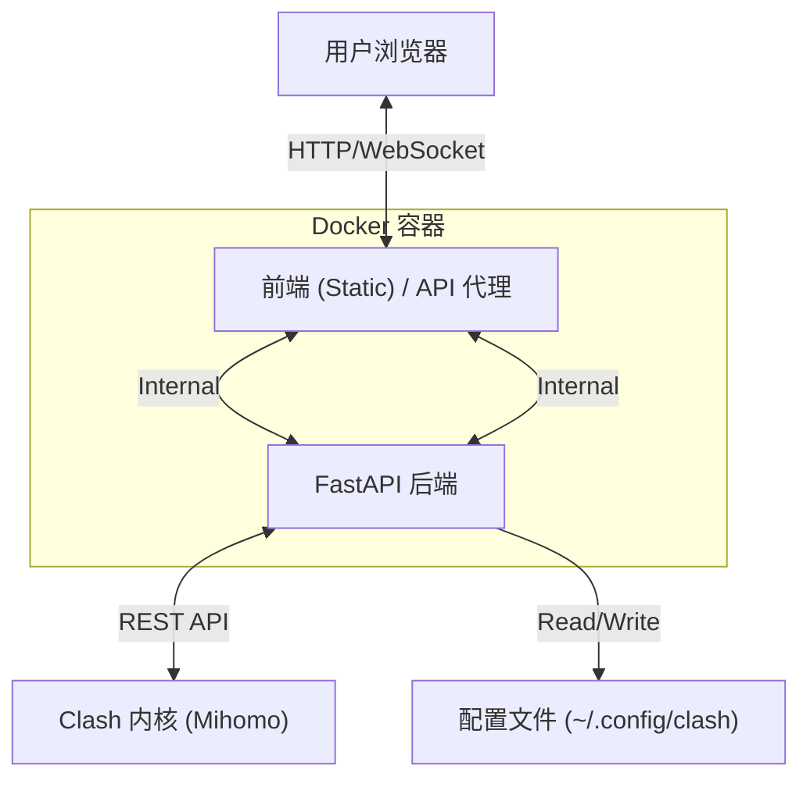

# ClashWebUI

<div align="center">


**ClashWebUI: 现代化 Clash 网页控制台**

基于 **React 18** + **FastAPI** 构建，提供与原版客户端一致的 "Premium" 级视觉体验与交互逻辑。

[特性](#-特性) • [安装](#-快速开始) • [Docker 部署](#-docker-部署) • [架构](#-架构设计) • [API 文档](#-后端-api) • [截图](#-应用截图)

</div>

## ✨ 特性

<div align="center">

| 模块 | 功能描述 |
| :--- | :--- |
| **仪表盘** (Dashboard) | 🚀 实时流量/内存/连接数监控 (WebSocket)<br>🌍 IP 归属地深度查询 (支持代理/直连对比)<br>⚡️ 真实网站测速 (Apple/Google/GitHub) |
| **代理管理** (Proxies) | 🌲 **策略组智能排序**: 优先级逻辑优化 (Global > Select > Others)<br>🔗 **链式代理**: 可视化查看流量经过的代理链<br>🚥 **延迟测试**: 支持并发测速与单节点重测 |
| **配置管理** (Profiles) | 📝 **多格式支持**: 兼容本地 YAML 文件与远程 URL 订阅<br>✏️ **高级编辑器**: 内置 Monaco Editor，支持 YAML 高亮与校验<br>🔄 **自动更新**: 支持设置订阅自动更新间隔 |
| **连接控制** (Connections) | 🔌 **实时会话**: 查看当前活动连接<br>🚫 **连接管理**: 支持一键断开指定连接 |
| **系统设置** (Settings) | 🛡️ **TUN 模式**: 一键开启虚拟网卡接管系统流量<br>⚙️ **混合端口**: 统一 HTTP/SOCKS5 端口配置<br>🔌 **开机自启**: 支持 Systemd 服务级开机自启 (WebUI + Core) |
</div>

## 🏗️ 架构设计

本项目采用 **Monorepo** (单体仓库) 架构，前后端分离：



### 目录结构
```bash
clashwebui/
├── apps/
│   ├── server/          # 🐍 Python 后端 (FastAPI)
│   │   ├── main.py      # 应用入口与 API 定义
│   │   └── requirements.txt
│   └── web/             # ⚛️ React 前端 (Vite)
│       └── ...
├── docs/                # 📄 文档与静态资源 (Logo, Screenshots)
├── Dockerfile           # 🐳 Docker 构建多阶段配置
├── requirements.txt     # 后端依赖清单
└── .github/workflows/   # 🤖 CI/CD 自动构建流程
```

## 🐳 Docker 部署

本项目支持 Docker 一键部署，镜像自动推送到 Docker Hub。

### 1. 启动容器

#### Linux / macOS
```bash
docker run -d \
  --name clashwebui \
  --restart always \
  --network host \
  -v ~/.config/clash:/root/.config/clash \
  qxdljy/clashwebui:latest
```

#### Windows (PowerShell)
```powershell
docker run -d `
  --name clashwebui `
  --restart always `
  -p 3001:3001 `
  -v $HOME/.config/clash:/root/.config/clash `
  -e "CLASH_EXTERNAL_CONTROLLER=host.docker.internal:9090" `
  -e "CLASH_MIXED_PORT=7890" `
  -e "CLASH_SECRET=your_secret" `
  qxdljy/clashwebui:latest
```

#### 环境变量配置

支持通过 `-e` 设置以下环境变量来覆盖默认行为：

| 变量名 | 默认值 | 说明 |
| :--- | :--- | :--- |
| `WEBUI_PORT` | `3001` | WebUI 后端监听端口 |
| `CLASH_MIXED_PORT` | `7890` | 混合代理端口 (HTTP + SOCKS5) |
| `CLASH_EXTERNAL_CONTROLLER` | `127.0.0.1:9092` | Clash 外部控制 API 地址 |
| `CLASH_SECRET` | `""` | Clash 外部控制密钥 |

*注意:*
- **Linux**: 建议使用 `--network host`。
- **Windows**: 由于不支持 host 网络，需映射端口 `3001`。
- **内核连接**: 在 Windows 上，容器访问宿主机内核需使用 `host.docker.internal` (例如在设置中填写 `host.docker.internal:9090`)。

### 2. CI/CD 自动构建

本项目包含 GitHub Actions 工作流 (`.github/workflows/docker-image.yml`)，当代码推送到 `master` 分支或发布 `v*` 标签时，会自动构建 Docker 镜像并推送到 `qxdljy/clashwebui`。

## 🚀 快速开始 (本地开发)

### 环境依赖
- **Node.js**: v18+
- **Python**: v3.10+
- **Clash 内核**: 需后台运行并开启 External Controller (默认 9090)

### 1. 安装依赖

**后端依赖**
```bash
pip install -r requirements.txt
```

**前端依赖**
```bash
cd apps/web
npm install
```

### 2. 启动服务

建议在两个终端窗口分别启动：

**终端 A: 后端服务**
```bash
# 在项目根目录下
python apps/server/main.py
# 服务地址: http://localhost:3001 (包含前端静态资源代理)
```

**终端 B: 前端开发服 (可选)**
```bash
# 如需调试前端代码
cd apps/web
npm run dev
# 访问地址: http://localhost:5173
```

## 🔌 后端 API

后端服务运行在端口 `3001`，提供以下核心 API：

### 配置与状态
- `GET /system_info`: 获取系统版本、Clash 运行模式及开机时间。
- `POST /preferences`: 更新系统设置（混合端口、External Controller 地址、密钥）。
- `GET /proxy_geoip`: 通过代理通道获取当前 IP 的 GeoIP 信息。
- **`GET/POST /auto_start`**: 配置 Systemd 开机自启服务 (Clash Core + WebUI)。

### 配置文件 (Profile)
配置存储于 `~/.config/clash/profiles/`。

- `GET /profiles`: 获取所有订阅/配置文件列表。
- `POST /profiles`: 导入新订阅 (支持 URL 或本地文件内容)。
- `PUT /profiles/select/:id`: 切换当前生效的配置文件 (会自动合并系统设置并写入 `config.yaml`)。
- `DELETE /profiles/:id`: 删除指定配置文件。

## 🗺️ 前端路由

<div align="center">

| 路径 | 页面组件 | 说明 |
| :--- | :--- | :--- |
| `/` | `Dashboard` | 系统概览与监控 |
| `/proxies` | `Proxies` | 代理节点选择与测速 |
| `/profiles` | `Profiles` | 订阅管理 |
| `/connections` | `Connections` | 当前活动连接列表 |
| `/rules` | `Rules` | 流量分流规则列表 |
| `/logs` | `Logs` | 实时内核日志 |
| `/settings` | `Settings` | 系统偏好设置 |
| `/test` | `Test` | 流媒体解锁检测 |

</div>

## ❓ 常见问题

**Q: 为什么 IP 信息显示不出来？**
A: IP 查询接口会尝试通过代理请求。请确保您的 Clash 内核正在运行，且系统代理或混合端口设置正确 (默认 7890)。

**Q: 如何修改 Clash 内核的连接信息？**
A: 在 `设置 (Settings)` 页面中可以修改 "外部控制 (External Controller)" 地址和 "密钥 (Secret)"。

**Q: 配置文件保存在哪里？**
A: Linux 系统下默认保存在 `/home/$USER/.config/clash/profiles`。

## 📜 许可证

MIT License
